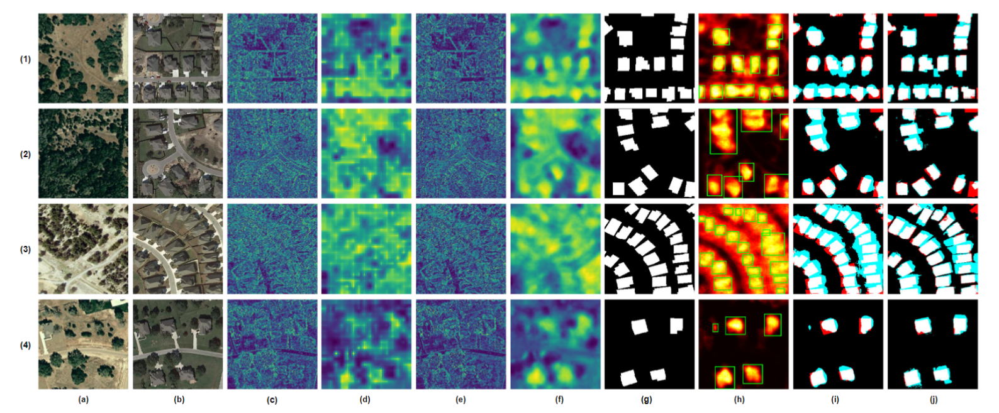
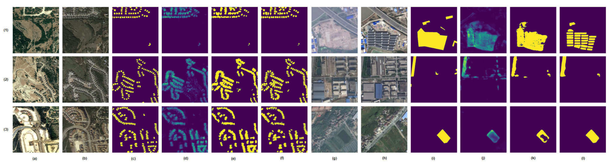
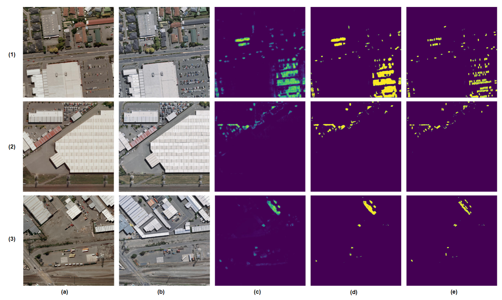

# 
`UniVCD: New Method for Unsupervised Change Detection in the Open-Vocabulary Era`

Code repository for the paper "UniVCD: New Method for Unsupervised Change Detection in the Open-Vocabulary Era".

Code will be released after paper being accepted.

---

